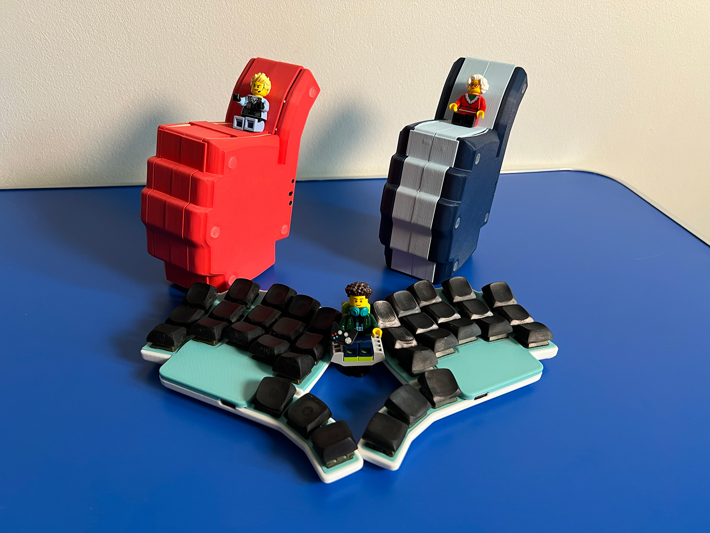
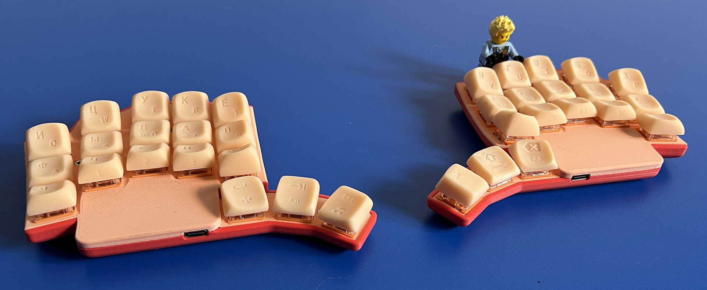
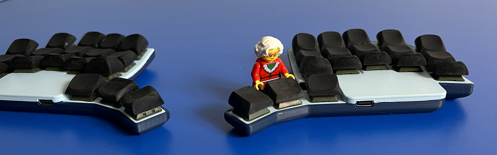
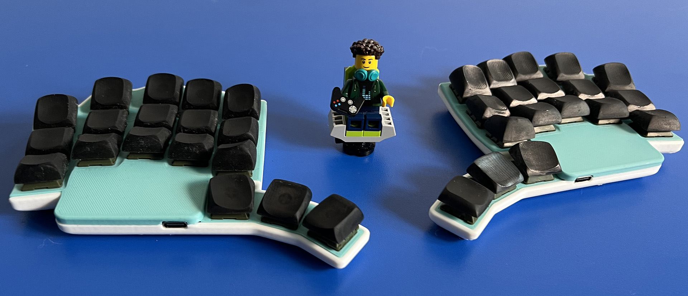
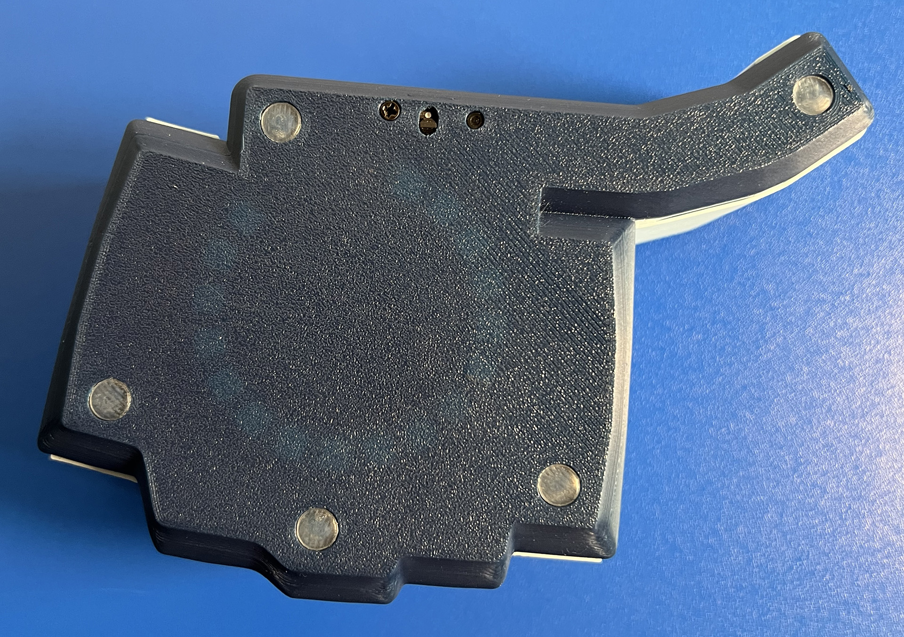
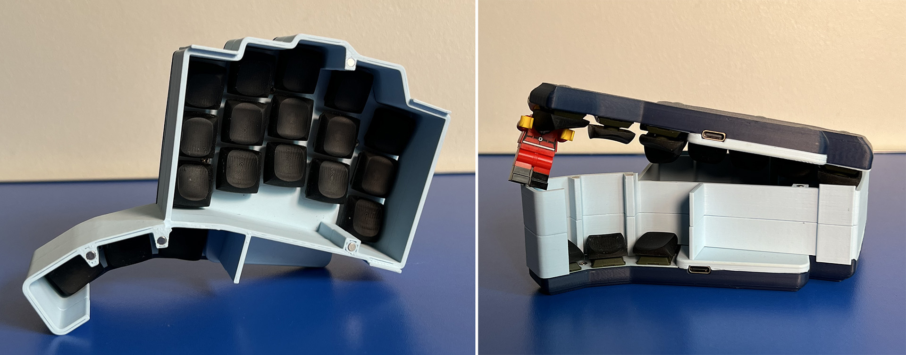

# LIKEeb

### 36-key split wireless keyboard

## Features
- 3x5 key matrix + 3 thumb keys
- highly staggered columns
- rotated pinky and ring columns
- dactyl-like curved columns (not rows)
- Xiao BLE wireless controllers
- hotswap Gateron and Choc V2 switches
- 400mAh battery lasts month or more
- integrated 50-mm magnetic ring
- 2-color case
- magnetic spacer
- no RGB, ergonomics only
- height-adapted DES-profile keycaps

## Comfort and Ergonomics

The curve, stagger, and rotation of the columns provide maximum ergonomics. All keys are easily pressed without moving the base of the hand (for M-L hand size).

Thanks to the low profile, the keyboard is comfortable to use without wrist rests and tents.

Placing the controller under the palm allows for convenient keyboard positioning on either side of a laptop, even on a small café table.

400mAh battery lasts more than a month. I haven’t been able to measure exactly how long, because I always forget when I last charged it :) With the new ZMK firmware using Bluetooth Low Energy protocol, one charge might last 3-4 months.

## Integrated Magnetic Ring

It’s very convenient for designing various mounts. You only need to attach a 0.6mm thick metal ring to the mount. Compared to a magnetic mount, this ring is very thin and much cheaper.

For example, I made a mount for an IKEA garden chair that is only 2mm thick. I simply attached it to the armrest of the chair and created a comfortable workspace: [IKEA chair holder.stl](./case/rev2.0/IKEA%20chair%20holder.stl)

## Convenient Transportation

The magnetic spacer connects two halves of the keyboard and protects the keys from accidental presses. I don’t even turn off the keyboard when I put it in my backpack.

